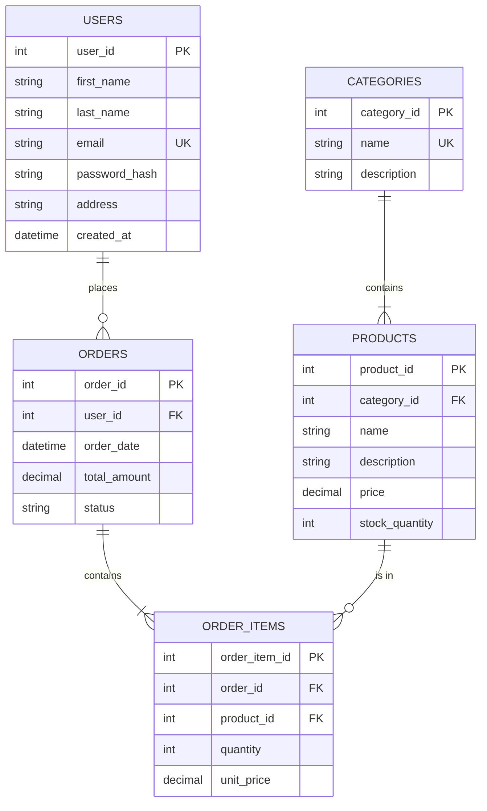

# 🗄️ Day 10: E-commerce Database Design

## 📝 Overview
This repository showcases a professional, normalized database schema designed for an E-commerce platform. It demonstrates advanced SQL concepts, including data modeling, referential integrity, indexing, and complex analytic queries.

## 🏗️ The Schema
The database follows **3rd Normal Form (3NF)** to ensure data integrity and minimize redundancy.

### Entity Relationship Diagram (ERD)


## 🚀 Key Features
- **Normalization**: Structured into 5 optimized tables (Users, Products, Categories, Orders, OrderItems).
- **Indexing Strategy**: B-tree indexes on foreign keys and frequently searched columns to ensure high performance at scale.
- **Relational Integrity**: Strict Foreign Key constraints to prevent orphaned records.
- **Analytic Ready**: Schema designed to support common business queries (Total Sales, Stock Alerts, Customer Behavior).

## 🛠️ Tech Stack
- **Database Engine**: PostgreSQL (SQLite used for local demonstration)
- **Modeling**: ER Diagrams (Mermaid.js)
- **Language**: SQL (DDL, DML)
- **Scripting**: Python (Pandas) for query execution and initialization

## 🏃 How to Run
1. Ensure you have Python installed.
2. Run the initialization script:
```bash
python main.py
```
This will create `ecommerce.db`, seed it with data, and run sample analytic queries.

---
*Developed as part of the 30-Day Recruiter Attraction Challenge.*
